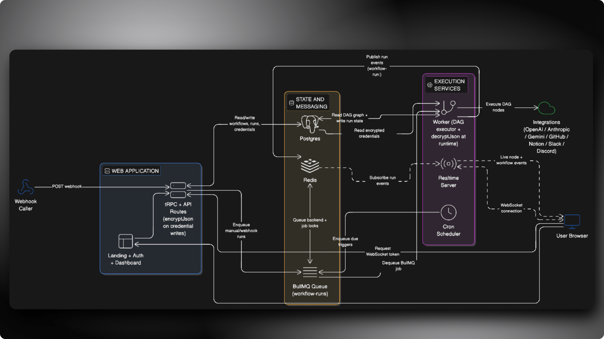

# Fynt

**Open-source workflow automation platform. Build, run, and monitor multi-step automations with a visual node editor.**


## What is Fynt?

Fynt is a self-hostable workflow automation platform. You drag nodes onto a canvas, wire them together, and let the engine execute them. Runs are distributed through a job queue, streamed live to the browser over WebSockets, and all credentials are encrypted at rest.

**What you can build:**
- AI pipelines that chain OpenAI, Anthropic, and Gemini calls
- GitHub webhooks that post summaries to Slack or Discord
- Scheduled data syncs between Notion, HTTP APIs, and your database
- Multi-step conditional automations with branching and filtering


## Architecture

Visual system design:




## Node Types

| Category | Nodes |
|----------|-------|
| **Triggers** | Manual, Webhook, Cron |
| **AI** | OpenAI, Anthropic, Gemini |
| **Integrations** | HTTP Request, GitHub, Notion, Slack, Discord |
| **Logic** | Condition, Filter |
| **Utilities** | Transform, Delay, Log |


## Monorepo Layout

```
fynt/
  apps/
    web/          Next.js frontend, tRPC API, workflow builder UI
    worker/       BullMQ job processor and cron scheduler
    realtime/     WebSocket relay server for live execution events
  packages/
    prisma/       Database schema, migrations, Prisma client
    shared/       Redis, queue, crypto, and runtime utilities
    eslint-config/ Shared ESLint rules
```


## Deployment Modes

| Mode | Deploy | Use when |
|------|--------|----------|
| Web only | `apps/web` | You want to show the UI only and do not want to run worker and realtime services |
| Full self-host | `apps/web` + `apps/worker` + `apps/realtime` | You want real workflow execution, cron scheduling, webhook ingestion, and live run streaming |

## Docker Full Self-Host (Recommended)

Run the full stack locally with one command:

```sh
cp .env.docker.example .env.docker
# fill required secrets in .env.docker
docker compose up --build
```

Services:
- Web: `http://localhost:3000`
- Realtime health: `http://localhost:3101/health`
- Postgres: `localhost:55432` (default; configurable via `FYNT_POSTGRES_PORT`)
- Redis: `localhost:6379`

Operational commands:

```sh
# stop containers
docker compose down

# stop + remove data volumes
docker compose down -v

# stream logs
docker compose logs -f web worker realtime bootstrap
```

Notes:
- This Docker stack runs **full self-host mode** (`FYNT_RUNTIME_MODE=full`) with automation enabled.
- Web-only mode is still available outside Docker.
- Docker stack reads `.env.docker`; `apps/web/.env` is not required for Docker runtime.

## Self-Hosted Setup (Manual, Non-Docker)

### 1. Clone and install

```sh
git clone https://github.com/your-org/fynt.git
cd fynt
pnpm install
```

### 2. Create environment file

```sh
cp .env.example .env
```

Use [`.env.example`](.env.example) as the source of truth.

### 3. Fill required variables

Required for both modes:

```sh
DATABASE_URL=postgresql://...
BETTER_AUTH_URL=http://localhost:3000
BETTER_AUTH_SECRET=...
ENCRYPTION_KEY=...
# Runtime mode for server-side guards
FYNT_RUNTIME_MODE=web-only   # use full for full self-host mode
# Runtime mode for client-side execute button behavior
NEXT_PUBLIC_FYNT_RUNTIME_MODE=web-only   # use full for full self-host mode
```

Required for full self-host mode:

```sh
# Option A (recommended, works with Upstash too)
REDIS_URL=redis://...   # or rediss://...

# Option B
REDIS_HOST=localhost
REDIS_PORT=6379

NEXT_PUBLIC_EXECUTION_WS_URL=ws://localhost:3101
EXECUTION_WS_URL=ws://localhost:3101
REALTIME_HOST=0.0.0.0
REALTIME_PORT=3101
```

### 4. Run migrations and seed baseline data

```sh
pnpm --filter @repo/prisma exec prisma migrate dev
pnpm db:seed
```

`pnpm db:seed` inserts baseline records like available triggers/actions required by workflow creation.

### 5. Start services

Web only mode:

```sh
# Keep builder UX enabled and block execution APIs + execute actions
FYNT_RUNTIME_MODE=web-only NEXT_PUBLIC_FYNT_RUNTIME_MODE=web-only pnpm --filter @fynt/web dev
```

Or set those two env vars in your deploy platform and run:

```sh
pnpm --filter @fynt/web dev
```

Full self-host mode:

```sh
pnpm dev
```

### Production runtime behavior

- `FYNT_RUNTIME_MODE=web-only` blocks:
  - workflow execution mutation
  - webhook ingestion route
  - execution websocket token route
- The workflow editor still allows adding/connecting/configuring nodes.
- Clicking execute in the UI shows the existing execution-blocked dialog.

If you run full self-host in production, set:

```sh
FYNT_RUNTIME_MODE=full
NEXT_PUBLIC_FYNT_RUNTIME_MODE=full
FYNT_ENABLE_AUTOMATION_IN_PRODUCTION=true
```


## Development Commands

```sh
# Start everything
pnpm dev

# Run a single service
pnpm --filter @fynt/web dev
pnpm --filter @fynt/worker dev
pnpm --filter @fynt/realtime dev

# Type checking
pnpm check-types

# Linting
pnpm lint

# Database
pnpm db:generate   # regenerate Prisma client
pnpm db:push       # push schema without migrations
pnpm db:seed       # seed with sample data
```


## Tech Stack

- **Frontend** - Next.js 16, React 19, React Flow, Tailwind CSS v4, Radix UI
- **API layer** - tRPC, better-auth
- **Job queue** - BullMQ on Redis
- **Database** - PostgreSQL via Prisma ORM
- **Realtime** - Node.js WebSocket server with Redis Pub/Sub
- **Encryption** - AES-256-GCM for all stored credentials
- **Monorepo** - Turborepo with pnpm workspaces
- **Language** - TypeScript throughout
